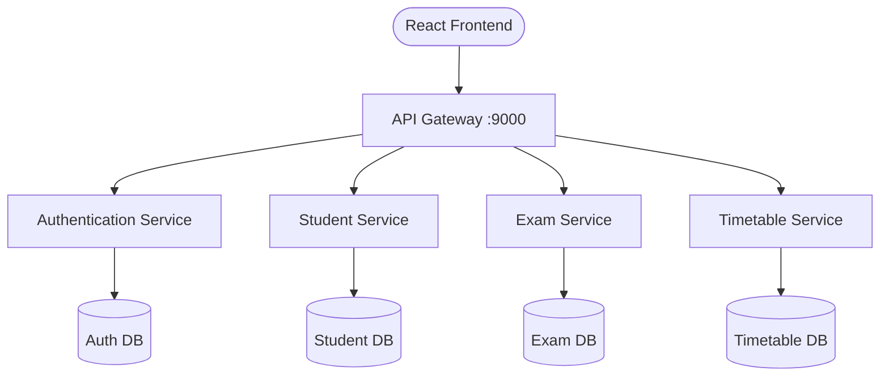

<div align="center">

# 🎓 SchoolDesk MS (School Management System)

[](https://reactjs.org/)
[](https://vitejs.dev/)
[](https://tailwindcss.com/)
[](https://fastapi.tiangolo.com/)
[](https://www.docker.com/)

A full-stack School Management System built using React, FastAPI, Docker, and a microservices architecture. The platform provides separate portals for teachers and students to manage attendance, examinations, timetables, and academic records through secure role-based authentication.

</div>

---

# Features

## Teacher Portal

- Teacher dashboard with academic overview
- Student onboarding and management
- Attendance management
- Examination and marks management
- Timetable creation with conflict validation
- AI assistant for quick navigation
- Profile and account settings

## Student Portal

- Secure login with JWT authentication
- Password reset on first login
- View attendance records
- View examination marks and performance
- Access class timetable
- View notes and academic resources

---

# Tech Stack

## Frontend

- React
- TypeScript
- Vite
- Tailwind CSS
- Framer Motion
- TanStack Query

## Backend

- FastAPI
- Python
- SQLModel
- REST APIs
- JWT Authentication

## DevOps & Cloud

- Docker
- Docker Compose
- GitHub Actions
- AWS EC2

---

# System Architecture

The project follows a microservices architecture where different services handle authentication, student management, examinations, and timetable management independently. All client requests are routed through an API Gateway.



---

# Services

| Service | Responsibility |
|----------|----------------|
| Frontend | User Interface |
| API Gateway | Routes incoming requests |
| Authentication Service | Login, JWT authentication, Role-Based Access |
| Student Service | Student records and attendance |
| Examination Service | Marks and examination management |
| Timetable Service | Timetable scheduling |

---

# Project Highlights

- Full-stack application using React and FastAPI
- Role-Based Access Control (Teacher & Student)
- JWT Authentication
- REST API-based communication
- Microservices architecture
- Dockerized deployment
- Automated frontend builds using GitHub Actions
- AWS EC2 deployment
- Responsive user interface

---

# Running the Project

### Clone the repository

```bash
git clone <repository-url>
cd SchoolDesk-MS
```

### Start the application

```bash
docker compose up --build
```

---

# Access the Application

Frontend

```
http://localhost:8080
```

API Documentation

```
http://localhost:9000/docs
```

---

# Demo Credentials

| Role | Email | Password |
|------|-------|----------|
| Teacher | teacher@school.com | password123 |
| Student | jahnvi@school.com | password123 |

Students are required to change their password after their first login.

---

# Security Features

- JWT Authentication
- Role-Based Access Control
- Password hashing using bcrypt
- Password reset on first login
- Protected API endpoints

---

# Future Enhancements

- Mobile application using React Native
- Push notifications for attendance and examination updates
- Parent portal
- Online assignment submission
- Performance analytics dashboard

---

# Project Structure

```
SchoolDesk-MS
│
├── frontend
├── api-gateway
├── auth-service
├── student-service
├── exam-service
├── timetable-service
├── docker-compose.yml
└── README.md
```
