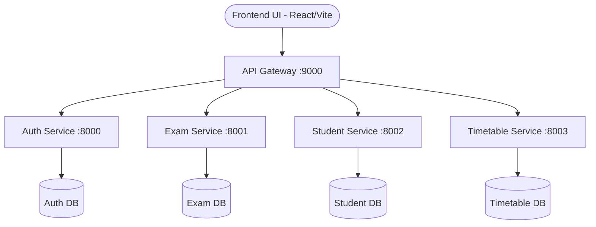

<div align="center">

# 🎓 SchoolDesk UMS (University Management System)

[](https://reactjs.org/)
[](https://vitejs.dev/)
[](https://tailwindcss.com/)
[](https://fastapi.tiangolo.com/)
[](https://www.docker.com/)

**A premium, microservices-based, highly scalable Student & Teacher Management System.**
Features dynamic role-based dashboards, integrated AI assistant, glassmorphism UI, and bulletproof JWT authentication.

---

</div>

## 🌟 Key Features

### 👩‍🏫 Teacher Portal
- **Intelligent Dashboard:** Real-time analytics, active class counts, and quick insights.
- **Roster & Student Management:** One-click student onboarding with auto-generated secure credentials.
- **Grades & Assessment:** Robust marks upserting, grade reports, and native exam tracking.
- **Attendance Ledger:** Comprehensive daily attendance logging with visual charts.
- **Conflict-Free Timetables:** Assign subjects to timeslots with intelligent overlap prevention.
- **AI Chatbot Integration:** Built-in floating AI assistant to help teachers navigate the platform.
- **Global Settings:** Multilingual support (English & Hindi) stored securely via TanStack Query and localized profiles.

### 👨‍🎓 Student Portal
- **Secure Onboarding:** Mandatory 30-day password rotation and forced reset on initial login.
- **Academic Performance:** Direct access to recorded marks, historical exams, and calculated percentages.
- **Live Schedules:** Daily class timetables with real-time updates.
- **Notes & Resources:** Dedicated academic tracking per student.

---

## 🏗️ Microservices Architecture

SchoolDesk is built using a highly decoupled, service-oriented architecture ensuring that no single point of failure can bring down the entire school ecosystem. 



| Service | Technology | Port | Responsibility |
| :--- | :--- | :--- | :--- |
| **Frontend** | React + Tailwind + Framer | `8080` | Client-facing dynamic application. |
| **API Gateway** | FastAPI + HTTPX | `9000` | Routes traffic, handles CORS, orchestrates microservices. |
| **Auth Service** | FastAPI + Passlib | `8000` | JWT issuance, RBAC, forced password resets, user profile avatars. |
| **Exam Service** | FastAPI + SQLModel | `8001` | Manages exams, tracks marks, calculates percentages. |
| **Student Service**| FastAPI + SQLModel | `8002` | Roster management and attendance tracking. |
| **Time Service** | FastAPI + SQLModel | `8003` | Class scheduling and timetable overlap prevention. |

---

## 🚀 Getting Started

You only need **Docker** and **Docker Compose** installed to run the entire cluster locally.

### 1. Build and Spin Up the Cluster
Run the following command in the root directory to build the images and start the orchestrated network:
```bash
docker compose up --build
```

### 2. Access the Application
- **Frontend App:** [http://localhost:8080](http://localhost:8080)
- **API Gateway Docs:** [http://localhost:9000/docs](http://localhost:9000/docs)

### 3. Initialize the Master Teacher
If booting from a fresh volume, you must generate the initial teacher via the API Gateway to gain access to the dashboard:
```bash
curl -X 'POST' \
  'http://localhost:9000/auth/register' \
  -H 'Content-Type: application/json' \
  -d '{
  "email": "teacher@school.com",
  "password": "password123",
  "role": "teacher"
}'
```

### 4. Demo Login Credentials
| Role | Email | Password |
| :--- | :--- | :--- |
| Teacher | `teacher@school.com` | `password123` |
| Student | `jahnvi@school.com` | `password123` |

*(Students must change their password on the first login.)*

---

## 🎨 Design & UI Philosophy
Built to feel like a modern SaaS rather than a legacy academic tool. We utilize **Radix UI Primitives** for unstyled accessibility, heavily customized with **Tailwind CSS** to create beautiful glassmorphic cards, smooth **Framer Motion** transitions, and dynamic SVGs from **DiceBear**.

## 🛡️ Security Posture
- **Stateless Authentication:** Fully JWT-based.
- **Role-Based Access Control (RBAC):** Backend dependency injection to isolate endpoints (`Depends(teacher_required)` vs `Depends(student_required)`).
- **Password Policies:** Enforced rotation via `requires_password_change` DB flags and salted bcrypt hashing via Passlib.